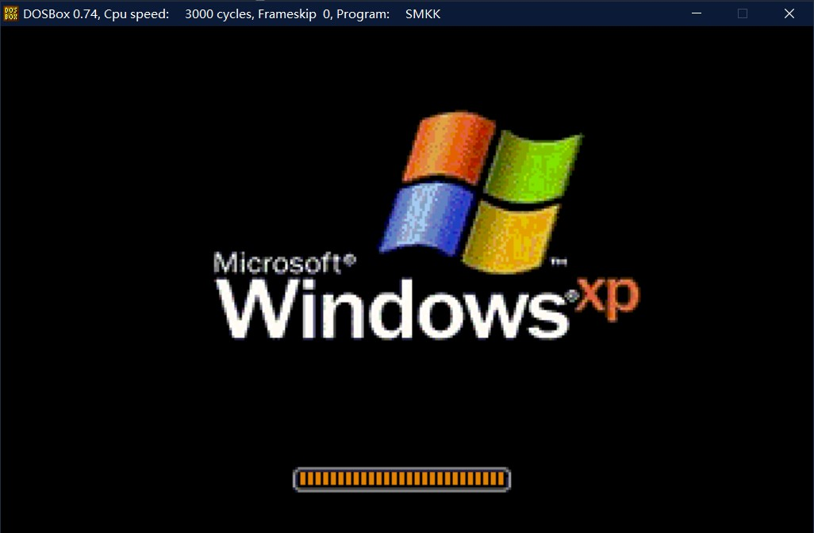
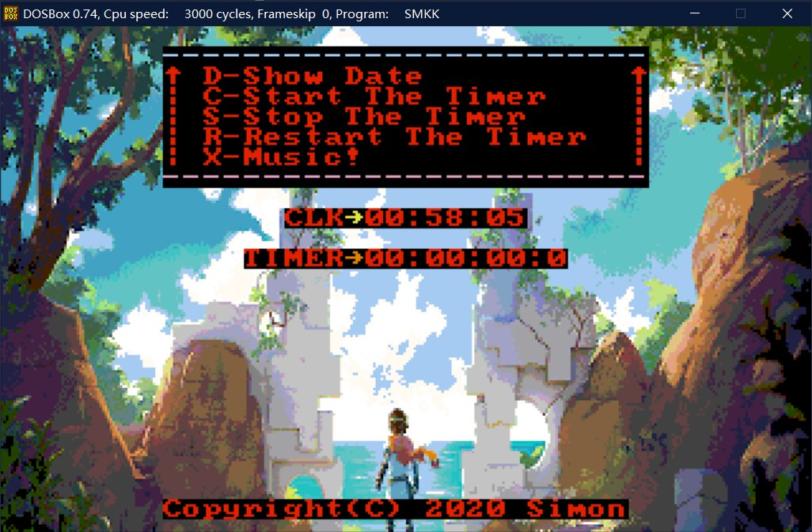
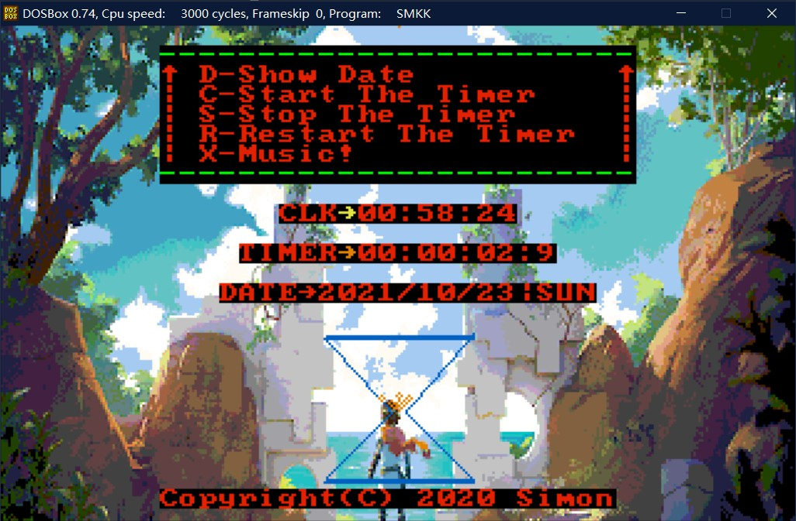
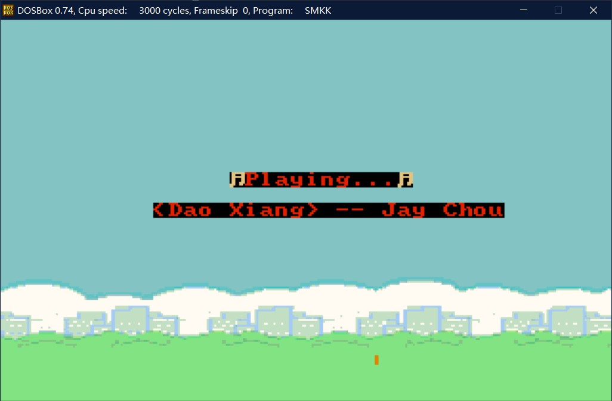

# Assembly

#### 介绍
汇编语言练习

#### 使用说明
1. smkk.asm为最终完成文件。
2. 程序需要在DOSBOX环境下运行，可以在VS Code中配合masm-code插件使用。
3. 画圆、画线、显示图片、播放音乐等宏/子过程可以单独移植使用。

#### 程序功能

1. 开机显示画面中WindowsXP下方的进度条能够滚动更新，实现拟“加载中”的效果，此时系统还会播放经典的Windows开机音乐。
   
   
   
2. 主界面中按D显示日期，能够将星期以三个缩写字母的形式显示出来。此时按下左或右方向键可以更改日期的显示位置（此功能在计时器开始后或进入音乐模式后被禁止使用）。

   

3. 按C启动定时器，屏幕中TIMER的值开始更新，能够精确到0.1s（事实上可以精确到0.001s,但更新频率太快会导致屏幕显示有延迟，故只精确到0.1s），此时CLK依然可以正常运行；菜单上下的横线开始出现霓虹闪烁效果；屏幕下方出现沙漏，且有沙砾流动效果。

   

4. 按S计数器停止计数，沙漏的沙砾停止流动，CLK正常更新。

5. 按R计数器清零，沙漏已流过的沙砾坐标复位。

6. 按X进入音乐模式，切换背景图片，屏幕中显示当前播放的歌曲信息，自动播放事先编制好的《稻香》。

   

7. 按Q程序结束，回到80*26的DOS文字模式界面中。

